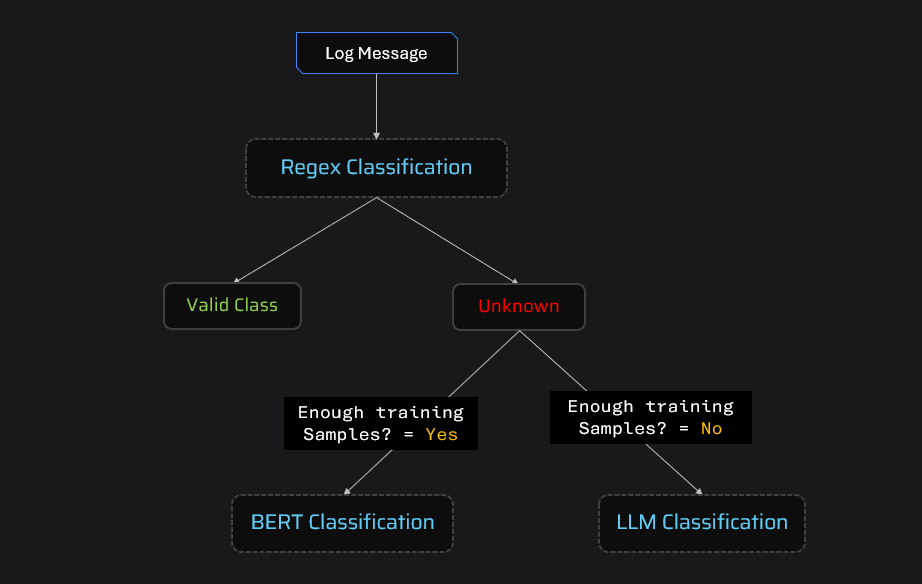

# Log Classification With Hybrid Classification Framework

This project implements a hybrid log classification system, combining three complementary approaches to handle varying levels of complexity in log patterns. The classification methods ensure flexibility and effectiveness in processing predictable, complex, and poorly-labeled data patterns.

---

## Log Classification – Hybrid Approach (Regex + BERT + LLM)

An end‑to‑end log classification app with a simple web UI and a REST API. It combines:
- **Regex rules** for predictable patterns
- **Sentence Transformers + Logistic Regression** for general patterns
- **LLM fallback** (optional via GROQ) for tricky/low‑data cases

### Architecture


### UI Preview
Place your UI screenshot at `resources/ui.png` and it will render here:


---

## Features
- Drag‑and‑drop CSV upload, live preview, validation
- Server health indicator, progress bar, clear success/error states
- Manual download button (no auto‑download after processing)
- API endpoint to classify CSVs programmatically
- Caching set to temp directories for easy deployment (Windows/Linux/Containers)

---

## Project Structure
- `app.py`: Flask application (web UI + API)
- `classify.py`: Batch utility to classify a CSV locally
- `processor_regex.py`: Regex classifier
- `processor_bert.py`: SentenceTransformer embeddings + logistic regression model loader
- `processor_llm.py`: Optional LLM fallback via GROQ (env var `GROQ_API_KEY`)
- `templates/index.html`: Frontend UI
- `models/`: Trained scikit‑learn classifier (`log_classifier.joblib`)
- `resources/`: Sample/test data and images

---

## Quickstart (Local)

### 1) Environment
```bash
python -m venv venv
# Windows PowerShell
./venv/Scripts/Activate.ps1
# macOS/Linux
source venv/bin/activate
```

### 2) Install dependencies
```bash
pip install -r requirements.txt
```

### 3) Run the web app
```bash
python app.py
```
Open `http://localhost:5000` in your browser.

Optional: classify sample CSV locally and produce `output.csv`:
```bash
python classify.py
```

---

## CSV Format
Your CSV must contain the columns:
- `source`
- `log_message`

Example rows:
```csv
source,log_message
ModernCRM,"IP 192.168.133.114 blocked due to potential attack"
BillingSystem,"User 12345 logged in."
```

The API returns a CSV with an added column `target_label`.

---

## API Usage

### Health
```bash
curl -s http://localhost:5000/health
```

### Classify CSV
```bash
curl -X POST \
  -F "file=@resources/test.csv" \
  -o classified_test.csv \
  http://localhost:5000/classify
```

---

## Deployment

### Railway (recommended)
1. Push code to GitHub
2. On Railway: New Project → Deploy from GitHub
3. It auto‑installs Python deps and starts with the default command from `Procfile`

Optional env vars:
- `GROQ_API_KEY` (only if you want LLM fallback for `LegacyCRM` sources)

Notes:
- First request may download the SentenceTransformer model; allow 30–90s and ~100–200MB cache in the container.
- Caches are routed to a writable temp dir automatically.

### Render
Already configured with `render.yaml` and `Procfile`.

### Docker
```bash
docker build -t log-classification .
docker run -p 5000:5000 log-classification
```
Open `http://localhost:5000`.

---

## Caching and Model Downloads
To avoid permission errors on hosts, the app sets cache locations at runtime to the OS temp directory using `tempfile.gettempdir()`:
- `HF_HOME`
- `HF_HUB_CACHE`
- `TRANSFORMERS_CACHE`
- `SENTENCE_TRANSFORMERS_HOME`

This ensures Hugging Face models download to a writable path (e.g., `/tmp/...` on Linux containers, `%LOCALAPPDATA%/Temp/...` on Windows).

---

## Troubleshooting
- **First run is slow / times out**: The embedding model (`all-MiniLM-L6-v2`) downloads on first use. Try again after the cache is warmed.
- **PermissionError for caches**: Confirm your host allows writing to temp directories. We default to OS temp; most PaaS providers allow this.
- **LLM fallback returns `Unclassified`**: Set `GROQ_API_KEY` if you want LLM classification for `LegacyCRM` logs.
- **CSV validation failed**: Ensure headers include `source` and `log_message` exactly.

---

